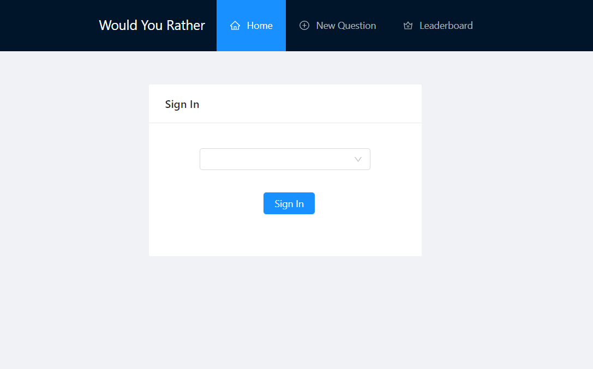
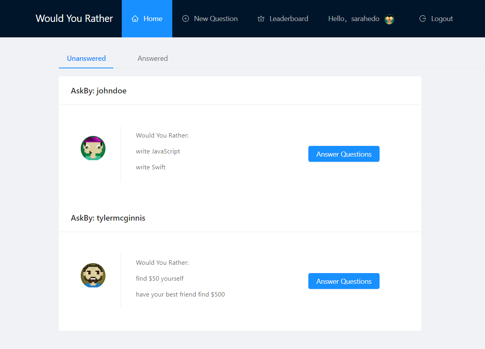
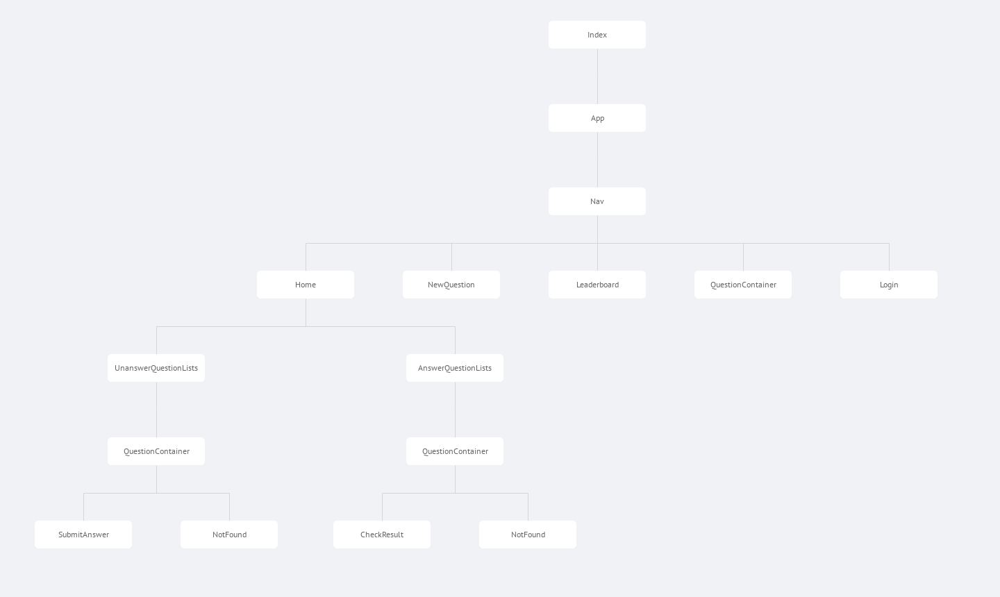

# Project：Would You Rather

Would you rather is a ReactJS app that allows a user to login, ask and answer different poll questions. It will also show a leaderboard based on the number of questions each user has asked and answered.

The primary purpose for developing Would You Rather was to gain exposure to React Router & Redux, thus core functionality such as user authentication and the project backend is mocked.

[Would You Rather Demo](https://moonfallmaple.github.io/would-you-rather-demo/)


<div  align="center">
Login
</b>

HomePage

</div>


## Steps to Install
In order to run the application you need:
- Node/npm [[download]](https://nodejs.org/en/)

### Installing

Clone the repo

```
git clone git@github.com:bigbhowell/would-you-rather.git
```

Change into the *would-you-rather* project directory

```
cd would-you-rather
```

Install project dependencies

```
npm install
```

And start the application

```
npm start
```

The app will automatically launch in your browser.


<div  align="center">
</b>
</div>

src-component
- App.js
- Home.js
- Leaderboard.js
- Login.js
- Nav.js
- NewQuestion.js
- NotFound.js
- UnanswerQuestionLists.js
- AnswerQuestionLists.js
- QuestionContainer.js
- SubmitAnswer.js
- CheckResult.js